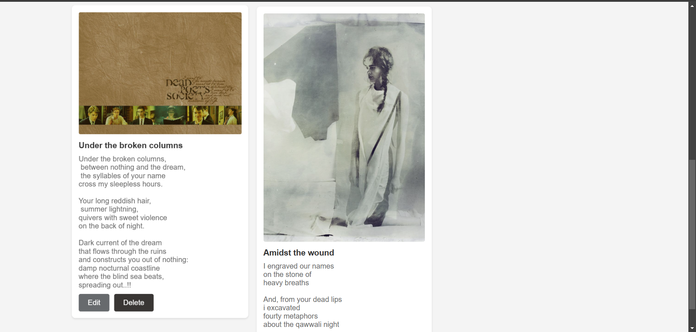
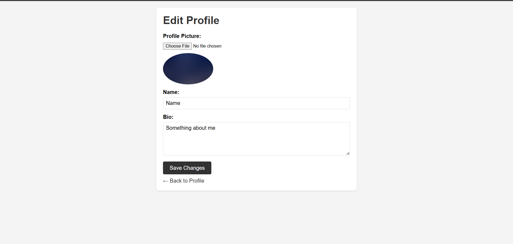
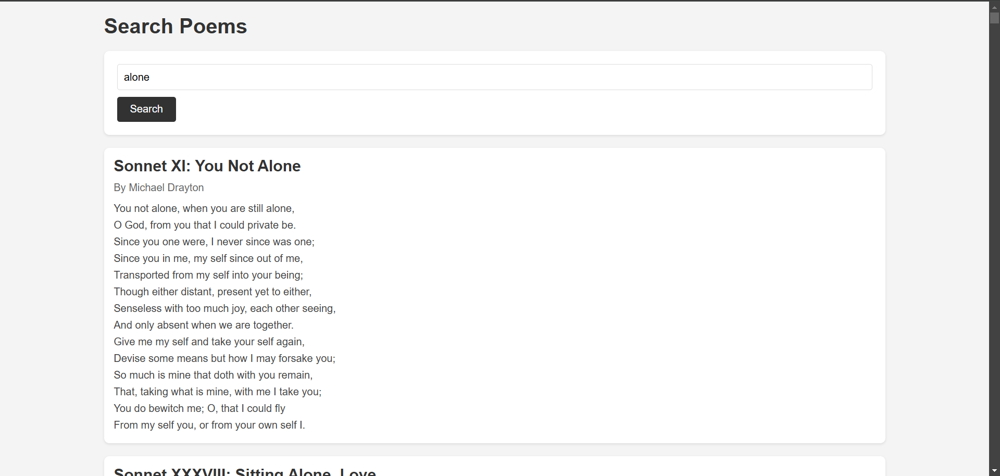
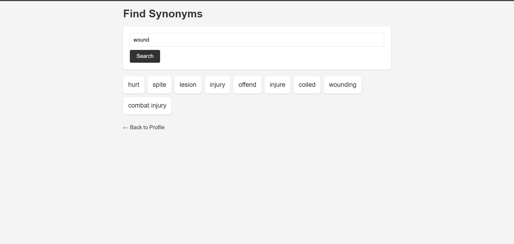

# [POETRY-ARCHIVE] 🎯

## Basic Details
### Team Name: [Individual]

### Team Members
- Member 1: [Kalyani Dhananjayan] - [College of engineering and management, punnapra]

### Hosted Project Link
[mention your project hosted project link here]

### Project Description
This Poetry Archive Website will provide a platform where users can:

Create Poems: Write and save poems with easy-to-use tools.
Search for Ideas and Words: Use features to search for synonyms, words, and poetic inspiration to enhance writing.
Discover and Explore: Browse an archive of poems by title, author, or theme, offering endless creative possibilities.
Foster a Creative Environment: Engage with other writers, share thoughts, and participate in discussions to nurture creativity.

### The Problem statement
Poetry enthusiasts often struggle to find a dedicated space to create, explore, and refine their work. Existing platforms lack tools for discovering poetic ideas, word suggestions, and an inspiring environment for writing.

### The Solution
Building a poetry archive website where users can write, store, and explore poems, search for ideas, synonyms, and inspirations, and get creative support. The platform will provide an engaging space to enhance the poetry-writing experience.

## Technical Details
### Technologies/Components Used
For Software:
- HTML
- CSS
- JAVASCRIPT
- PoetryDB API
- Thesaurus API

### Implementation
Used the following technologies and APIs to build the Poetry Archive website:
HTML: Structured the webpage with essential elements like headers, forms, and containers for poems and search results.
CSS: Styled the website to create a clean, user-friendly interface, focusing on responsiveness and visual appeal.
JavaScript: Added interactivity to the website, enabling features like poem search, display of results, and dynamic content updates.
PoetryDB API: Integrated this API to fetch and display poems based on search queries, providing users access to a vast collection of poems by title, author, and keywords.
Datamuse API: Used this API to provide word suggestions and synonyms, helping users find the right words and enhance their poetry creation process.

# Installation
git clone https://github.com/KalyaniDhananjayan/POETRY-ARCHIVE.git

# Run
run indexhtml and follow the buttons

### Project Documentation
Overview:
The Poetry Archive website allows users to create, search, and explore poems while providing tools for inspiration and word suggestions. It fosters a creative environment for both beginners and experienced poets to express their thoughts and connect with others.

Features:
Create Poems: Write and save poems.
Search Poems: Search for poems by title, author, or keywords.
Word Suggestions: Get synonyms and word ideas for creative writing.
Explore Archive: Browse a collection of poems and discover new works.
User Engagement: Share creations and interact with other writers.

Technology Stack:
HTML: Structure and content layout.
CSS: Styling for a responsive and user-friendly design.
JavaScript: Dynamic behavior and interaction.
PoetryDB API: Fetching and displaying poems.
Datamuse API: Word suggestions and synonyms for writing assistance.

# Screenshots (Add at least 3)

*profile page*

*poem collections*

*page to edit profile*

*page to find poems and inspirations*

*page to find word synonyms*

# Build Photos

### Project Demo
# Video
https://www.loom.com/share/80149df8bb0d40f5a7ea382c7aa70cf5?sid=c9785e15-a4d0-472c-83eb-1e92541a9b10
demonstrates the working of the site

# Additional Demos
[Add any extra demo materials/links]

## Team Contributions
- [Name 1]: [Specific contributions]
- [Name 2]: [Specific contributions]
- [Name 3]: [Specific contributions]

---
Made with ❤️ at TinkerHub
